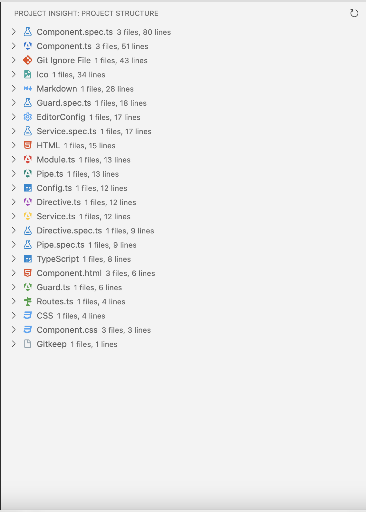
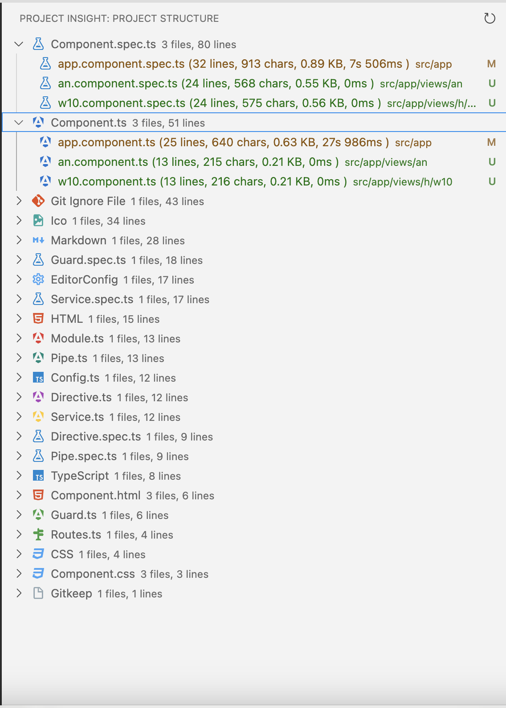

# Project Insight 📊⏱️


[](https://marketplace.visualstudio.com/items?itemName=YourPublisherName.project-insight)
[](https://marketplace.visualstudio.com/items?itemName=YourPublisherName.project-insight)
[](https://marketplace.visualstudio.com/items?itemName=YourPublisherName.project-insight)
[](https://github.com/salah-alhajj/project-insight/blob/main/LICENSE)

https://github.com/salah-alhajj/project-insight

Project Insight is a powerful Visual Studio Code extension that provides comprehensive coding time tracking and project analysis features. Gain valuable insights into your coding patterns, project structure, and time management with intuitive visualizations and detailed statistics.

## 🌟 Features

### 🕰️ Coding Time Tracking
- **Real-time Tracking**: Automatically tracks your coding time as you work.
- **File-level Granularity**: Get detailed time stats for each file in your project.
- **Intelligent Idle Detection**: Accurately measures active coding time by detecting periods of inactivity.

### 📊 Project Analysis
- **File Extension Overview**: Visualize your project's composition with a breakdown of file types.
- **Line Count Statistics**: Get accurate line counts for each file and file type.
- **Size Analysis**: See file sizes and overall project size at a glance.

### 🌳 Project Structure Visualization
- **Tree View**: Explore your project structure in an intuitive, collapsible tree view.
- **Quick Navigation**: Easily navigate to files directly from the Project Insight sidebar.

### 💾 Persistent Data Storage
- **Local Database**: All your coding stats are securely stored in a local database.
- **Long-term Insights**: Track your progress and coding patterns over time.

### 🎨 Customization
- **Configurable Inclusions/Exclusions**: Tailor the analysis to your needs by specifying which files and folders to include or exclude.
- **Language-specific Settings**: Fine-tune the extension's behavior for different programming languages.

## 📸 Screenshots




*Project overview showing file type distribution and lines count and chars*



*Detailed view of a specific file with line count, size, and coding time information*

## 🚀 Getting Started

1. Install the Project Insight extension from the [Visual Studio Code Marketplace](https://marketplace.visualstudio.com/items?itemName=YourPublisherName.project-insight).
2. Open a project in VS Code.
3. The Project Insight sidebar will automatically appear, showing your project analysis.
4. Start coding, and watch as Project Insight tracks your time and updates the project statistics!

## ⚙️ Configuration

Project Insight can be customized to fit your workflow. Here are some key settings:

```json
{
  "projectInsight.includeExtensions": [".js", ".ts", ".py"],
  "projectInsight.excludeFolders": ["node_modules", ".git"],
  "projectInsight.idleTimeThreshold": 300,
  "projectInsight.refreshInterval": 60
}
```

For a full list of configuration options, please refer to the [Configuration Guide](https://github.com/salah-alhajj/project-insight/wiki/Configuration).

## 📘 Usage Tips

- Use the refresh button in the Project Insight sidebar to update the analysis after making significant changes to your project structure.
- Hover over items in the tree view for additional information and quick actions.
- Check the status bar for a quick glance at your current coding session duration.

## 🤝 Contributing

We welcome contributions to Project Insight! Whether it's bug reports, feature requests, or code contributions, please feel free to reach out. Check out our [Contribution Guidelines](https://github.com/salah-alhajj/project-insight/blob/main/CONTRIBUTING.md) for more information.

## 📜 License

This project is licensed under the MIT License. See the [LICENSE](https://github.com/salah-alhajj/project-insight/blob/main/LICENSE) file for details.

## 👏 Acknowledgements

- Thanks to all the contributors who have helped shape Project Insight.
- Special thanks to the VS Code team for providing an excellent extension API.

## 📞 Support

If you encounter any issues or have questions, please file an issue on our [GitHub Issue Tracker](https://github.com/salah-alhajj/project-insight/issues).

---

<p align="center">
  Made with ❤️ by developers, for developers.
</p>

